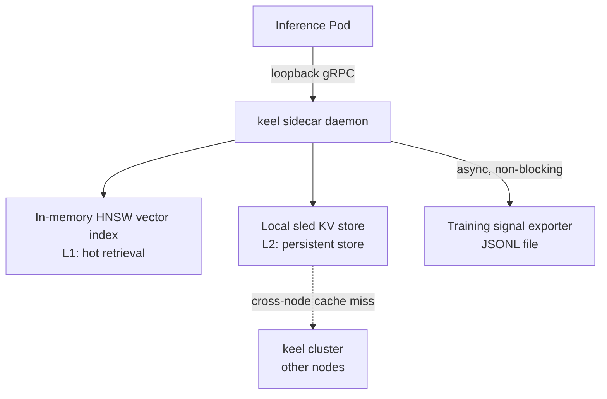
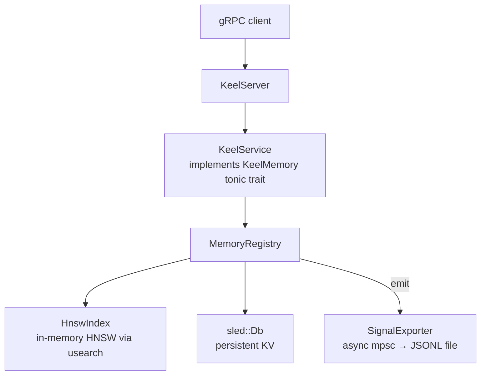

# keel

A Rust-native distributed memory daemon designed to run as a Kubernetes DaemonSet sidecar on LLM inference nodes. keel extends the effective context window of large language models by providing fast, hierarchically-addressable memory at the infrastructure layer — without requiring application-layer changes.

Secondary purpose: generate training signal (retrieval patterns, eviction outcomes, session graphs) for long-context curriculum training pipelines.

**The caller always provides embeddings** — keel is model-agnostic and does not generate them.

## Architecture



### Request path



### gRPC API

Defined in `proto/keel.proto`:

| RPC | Description |
|---|---|
| `Write` | Store a `MemoryChunk` in both the HNSW index and sled |
| `Read` | Fetch a chunk by ID; returns `None` if expired (TTL) |
| `SemanticSearch` | Top-k nearest-neighbor search over stored embeddings |
| `Evict` | Remove all chunks belonging to a session |
| `Health` | Returns status and total chunk count |

### MemoryChunk

The canonical unit of storage:

| Field | Type | Notes |
|---|---|---|
| `id` | string | Auto-assigned UUID if empty on write |
| `embedding` | bytes | f32 array, little-endian encoded |
| `payload` | bytes | Arbitrary content |
| `session_id` | string | Used for session affinity and eviction |
| `ttl_ms` | uint64 | `0` = no expiry; checked lazily on read |
| `meta` | map<string,string> | Arbitrary key-value metadata |

## Building

```bash
cargo build
cargo build --release
```

The proto file is compiled at build time via `tonic-build`. Generated code lives in `src/pb/keel.rs`. After editing `proto/keel.proto`, run `cargo build` to regenerate.

## Running

```bash
cargo run -- --bind-address 127.0.0.1:9090 --data-dir /var/keel/data
```

All flags (with defaults):

| Flag | Default | Description |
|---|---|---|
| `--bind-address` | `127.0.0.1:50051` | gRPC listen address |
| `--data-dir` | `./data` | sled storage directory |
| `--vector-dim` | `1536` | Embedding dimensionality |
| `--hnsw-m` | `16` | HNSW max connections per node |
| `--hnsw-ef-construction` | `200` | HNSW build quality |
| `--signal-output-path` | `./signals.jsonl` | Training signal log path |

## Tests

```bash
# All tests
cargo test

# Single test by name
cargo test test_write_and_read

# Integration tests only
cargo test --test integration_write_read
cargo test --test integration_search

# Unit tests only
cargo test --lib
```

## Docker

```bash
docker build -t keel .
docker run -p 9090:9090 keel --bind-address 0.0.0.0:9090
```

## Kubernetes

keel is designed to run as a DaemonSet — one instance per inference node. Inference pods connect over a shared loopback or Unix socket; no service discovery is needed within a node. See `plans/keel_build_plan.md` for the full DaemonSet manifest and configuration reference.

## Roadmap

| Phase | Status | Description |
|---|---|---|
| 1 | ✅ Complete | Single-node daemon: write, read, semantic search, TTL, session eviction, health, signal export |
| 2 | Planned | Multi-node gossip replication; session affinity routing |
| 3 | Planned | KV cache prefix sharing backed by memory-mapped files |
| 4 | Planned | S3 training signal export as Parquet |
