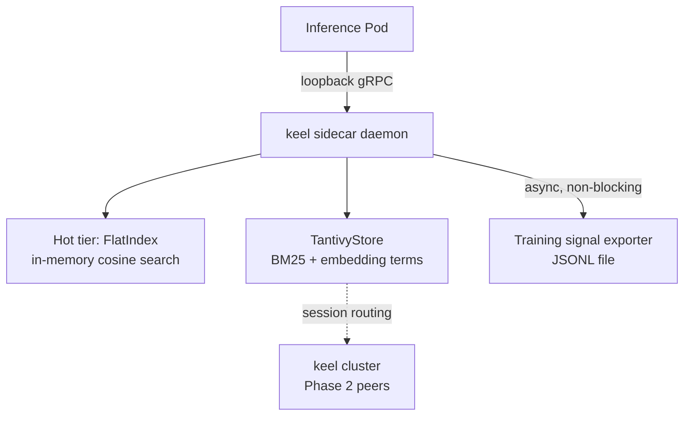
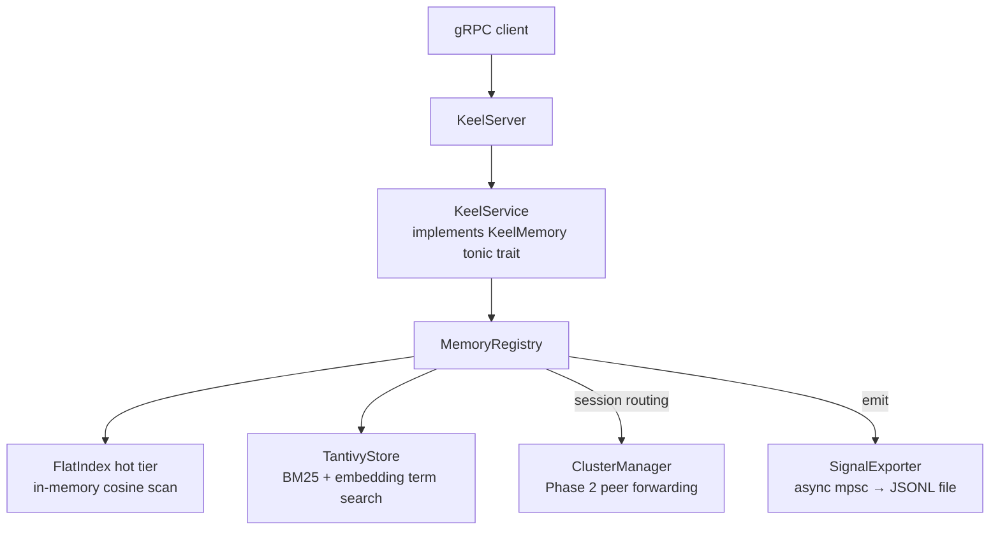
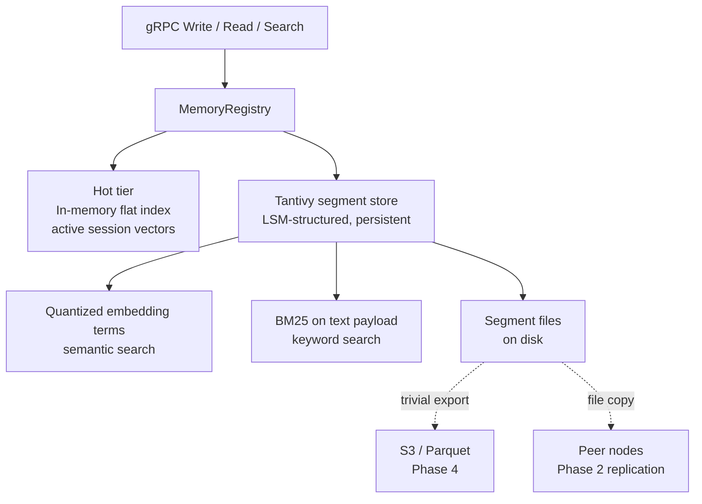
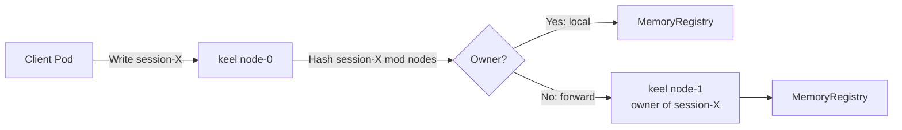
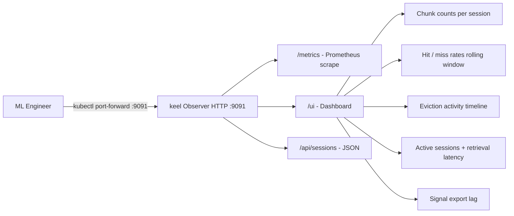

# keel

A Rust-native distributed memory daemon designed to run as a Kubernetes DaemonSet sidecar on LLM inference nodes. keel extends the effective context window of large language models by providing fast, hierarchically-addressable memory at the infrastructure layer — without requiring application-layer changes.

Secondary purpose: generate training signal (retrieval patterns, eviction outcomes, session graphs) for long-context curriculum training pipelines.

**The caller always provides embeddings** — keel is model-agnostic and does not generate them.

## Architecture



### Request path



### gRPC API

Defined in `proto/keel.proto`:

| RPC | Description |
|---|---|
| `Write` | Store a `MemoryChunk`; Phase 2 forwards to session-owning peer if cluster is active |
| `Read` | Fetch a chunk by ID; returns `None` if expired (TTL) |
| `SemanticSearch` | Top-k nearest-neighbor search over stored embeddings |
| `Evict` | Remove all chunks belonging to a session |
| `Health` | Returns status and total chunk count |

### MemoryChunk

The canonical unit of storage:

| Field | Type | Notes |
|---|---|---|
| `id` | string | Auto-assigned UUID if empty on write |
| `embedding` | bytes | f32 array, little-endian encoded |
| `payload` | bytes | Arbitrary content |
| `session_id` | string | Used for session affinity and eviction |
| `ttl_ms` | uint64 | `0` = no expiry; checked lazily on read |
| `meta` | map<string,string> | Arbitrary key-value metadata |

## Building

```bash
cargo build
cargo build --release
```

The proto file is compiled at build time via `tonic-build`. Generated code lives in `src/pb/keel.rs`. After editing `proto/keel.proto`, run `cargo build` to regenerate.

## Running

```bash
cargo run -- --bind-address 127.0.0.1:9090 --data-dir /var/keel/data
```

All flags (with defaults):

| Flag | Default | Description |
|---|---|---|
| `--bind-address` | `127.0.0.1:50051` | gRPC listen address |
| `--data-dir` | `./data` | sled storage directory |
| `--vector-dim` | `1536` | Embedding dimensionality |
| `--hnsw-m` | `16` | HNSW max connections per node |
| `--hnsw-ef-construction` | `200` | HNSW build quality |
| `--signal-output-path` | `./signals.jsonl` | Training signal log path |

## Tests

```bash
# All tests
cargo test

# Single test by name
cargo test test_write_and_read

# Integration tests only
cargo test --test integration_write_read
cargo test --test integration_search

# Unit tests only
cargo test --lib
```

## Docker

```bash
docker build -t keel .
docker run -p 9090:9090 keel --bind-address 0.0.0.0:9090
```

## Kubernetes

keel is designed to run as a DaemonSet — one instance per inference node. Inference pods connect over a shared loopback or Unix socket; no service discovery is needed within a node. See `plans/keel_build_plan.md` for the full DaemonSet manifest and configuration reference.

## Roadmap

| Phase | Status | Description |
|---|---|---|
| 1 | ✅ Complete | Single-node daemon: write, read, semantic search, TTL, session eviction, health, signal export |
| 1.5 | ✅ Complete | **Tantivy storage layer** — FlatIndex hot tier + TantivyStore (BM25 + quantized embedding terms) |
| 2 | 🔜 In Progress | **Multi-node routing** — session-affinity consistent-hash routing, peer forwarding via tonic client |
| 3 | Planned | KV cache prefix sharing backed by memory-mapped files |
| 4 | Planned | S3 training signal export as Parquet |
| 5 | Planned | **Observer UI** — lightweight HTTP dashboard for ML engineers to monitor keel during training runs via `kubectl port-forward` |

### Phase 1.5 — Tantivy Storage Layer

Replace the current `usearch` + `sled` dual-store with [Tantivy](https://github.com/quickwit-oss/tantivy) as the primary segment/storage backend, keeping a small in-memory flat index as a hot tier for active sessions.

**Architecture after migration:**



**Why this matters:**

- **Hybrid search** — BM25 keyword search over `payload` text combined with quantized embedding terms gives keel something no existing LLM memory system has: semantic + keyword retrieval in a single query over the same store
- **Clean deletion semantics** — Tantivy's segment structure handles deletes correctly; usearch has no native delete, only tombstones
- **Replication becomes file copy** — Tantivy segment files are immutable once written; Phase 2 gossip replication can ship segment files directly rather than replicating individual chunk state
- **Parquet export for free** — segment files map cleanly to Parquet columnar format for Phase 4 training signal export; no separate export pipeline needed
- **LSM structure** — write-optimized, naturally handles the append-heavy workload of an LLM memory daemon

**Migration path — gRPC API does not change:**

| Component | Before | After |
|---|---|---|
| Semantic search | `HnswIndex` (usearch) | Tantivy quantized embedding terms + hot-tier flat index |
| Keyword search | Not supported | Tantivy BM25 on `payload` |
| Persistence | `sled` KV store | Tantivy segment store |
| Hot session tier | None | In-memory flat index (existing `VectorIndex`) |
| `MemoryRegistry` API | Unchanged | Unchanged |

### Phase 2 — Multi-node Routing (In Progress)

Session-affinity routing so each `session_id` is consistently directed to the same node, eliminating cross-node lookup and enabling incremental replication.

**Design:**



**What's implemented:**

| Component | Status | Notes |
|---|---|---|
| `router.rs` / `SessionRouter` | ✅ Done | Consistent-hash (FNV) session → node mapping |
| `cluster.rs` / `ClusterManager` | ✅ Done | Lazy tonic client pool per peer; `get_client(addr)` |
| `server.rs` forwarding | ✅ Done | `Write` forwards to peer; falls back to local on peer unavailable |
| Peer discovery | Config-driven | Set `KEEL_PEERS=node-1:50051,node-2:50051` or `--peers` flag |
| Fan-out `SemanticSearch` | TODO | Currently searches local node only; cross-node fan-out in next iteration |
| Gossip / health | TODO | Peer failure detection; for now assumes peers are healthy |

**Kubernetes deployment:**
```yaml
env:
  - name: KEEL_NODE_ID
    valueFrom:
      fieldRef:
        fieldPath: spec.nodeName
  - name: KEEL_PEERS
    value: "keel-node-1.keel.svc:50051,keel-node-2.keel.svc:50051"
```

### Phase 5 — Observer UI

A lightweight HTTP server (port `9091`, already reserved in the DaemonSet spec) serving a read-only dashboard that ML engineers can reach during a training run without touching the gRPC API or the inference stack.

**Access pattern:**
```bash
kubectl port-forward daemonset/keel 9091:9091
# then open http://localhost:9091 in a browser
```

**What it shows:**



**Implementation:**
- Single additional port on the existing keel binary — no separate sidecar
- `/metrics` — [Prometheus](https://prometheus.io/) exposition format; scrape with existing cluster monitoring or `curl`
- `/ui` — server-rendered HTML (no JS framework); auto-refreshes every few seconds
- `/api/sessions` — JSON snapshot of active sessions, chunk counts, and last-access times for programmatic querying
- Backed by counters and a short rolling window maintained inside `SignalExporter` — no additional storage
- Read-only; no writes or config changes exposed

**Crates:**
```toml
axum = "0.7"
prometheus = "0.13"
```
